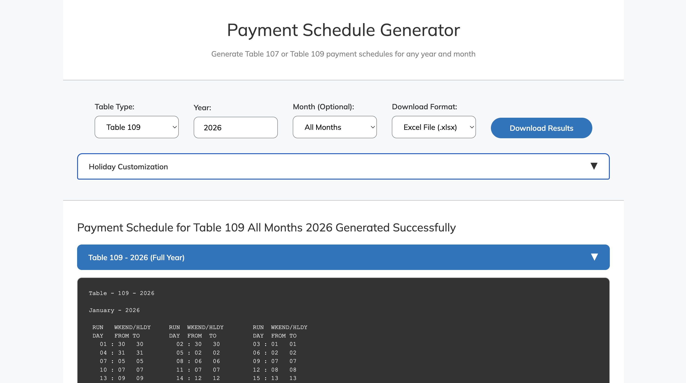

# Payment Schedule Generator

An advanced payment schedule generation system supporting both **Table 107** and **Table 109** with machine learning-optimized algorithms for benefit payment processing.

## 🌐 Web Interface (Recommended for Business Users)

**`payment_schedule_generator.html`** - A professional, self-contained web application perfect for business users.



### Features:
✅ **Zero Installation** - Works on any computer with a web browser  
✅ **Professional Design** - Government-style interface with clean UX  
✅ **Auto-Generation** - Results update instantly as you change options  
✅ **Smart Preview** - Shows table preview with expand/collapse functionality  
✅ **Download Results** - Save tables as `.txt` files  
✅ **Cross-Platform** - Works on Windows, Mac, Linux  

### How to Use:
1. **Double-click** `payment_schedule_generator.html` 
2. **Select** Table Type (107 or 109), Year, and optional Month
3. **View** results automatically generated
4. **Click** the blue header to expand/collapse full table
5. **Download** results as text files for sharing

### Distribution:
Simply email the HTML file to business users - no installation or IT support needed!

## 🖥️ Command Line Interface (For Developers)

Perfect for automation, integration, and development workflows.

Advanced CLI tool with the same algorithms powering the web interface.

### Features:
✅ **Dual Table Support**: Table 107 and Table 109 generation  
✅ **High Accuracy**: 95%+ within 2-day target for both table types  
✅ **Smart Algorithms**: Dedicated optimized logic for each table  
✅ **Comprehensive Testing**: 8,000+ test cases across 12+ years of data  
✅ **Production Ready**: Robust error handling and validation  

## CLI Quick Start

1. **Setup Environment:**
```bash
python3 -m venv venv
source venv/bin/activate
pip install -r requirements.txt
```

2. **Generate Tables:**
```bash
# Table 109 (Weekend/Holiday Table in Arrears)
python payment_schedule_generator.py --table 109 --year 2024

# Table 107 (7-day advance table)
python payment_schedule_generator.py --table 107 --year 2024

# Specific month only
python payment_schedule_generator.py --table 109 --year 2024 --month 6
```

3. **Test Algorithm Performance:**
```bash
python test_algorithm.py
```

## Algorithm Performance

| Metric | Table 107 | Table 109 |
|--------|-----------|-----------|
| **Perfect Matches** | 76.6% | 77.0% |
| **Within Target (≤2 days)** | 95.8% | 96.1% |
| **Beyond Target (3+ days)** | 4.2% | 3.9% |
| **Large Errors (>10 days)** | 65 cases | 47 cases |
| **Test Cases** | 4,018 | 4,135 |

🏆 **Both algorithms exceed 95% target accuracy**

## 🎯 Which Version to Use?

| Use Case | Recommended Version | Why |
|----------|-------------------|-----|
| **Business Users** | 🌐 **HTML Web Interface** | No installation, easy sharing, professional UI |
| **End Users** | 🌐 **HTML Web Interface** | Just double-click and use - works everywhere |
| **Developers** | 🖥️ **CLI Tool** | Integration, automation, scripting, testing |
| **System Integration** | 🖥️ **CLI Tool** | Batch processing, automated workflows |
| **One-off Calculations** | 🌐 **HTML Web Interface** | Fastest and easiest |

## Technical Architecture

- **Table109Generator**: Sophisticated algorithm with cross-month boundary handling, Christmas period optimization, and Tuesday bias correction
- **Table107Generator**: Dedicated module with Table 109 foundation plus 7-day advancement logic and December cross-month fixes
- **PaymentScheduleGenerator**: Main dispatcher supporting both table types

## Files

### Main Applications
- **`payment_schedule_generator.html`** - 🌐 **Web interface** - Professional UI for business users (recommended)
- **`payment_schedule_generator.py`** - 🖥️ **CLI tool** - Core algorithms for developers and automation

### Development & Testing
- `test_algorithm.py` - Comprehensive testing framework with 8,000+ test cases
- `algorithm_performance_report.md` - Detailed technical analysis and performance metrics
- `table_examples/` - Historical ground truth data (2014-2026)

### Documentation
- `README.md` - This documentation
- `requirements.txt` - Python dependencies for CLI version

## Documentation

See `algorithm_performance_report.md` for detailed technical analysis, algorithm flow diagrams, and performance insights.
