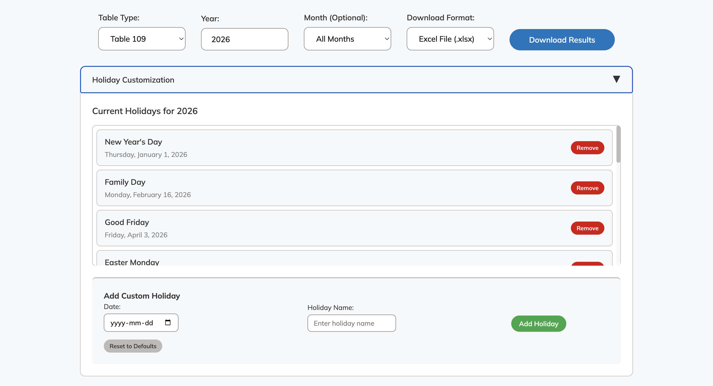

# Payment Schedule Generator

Generate **Table 107** and **Table 109** payment schedules with 95%+ accuracy using machine learning-optimized algorithms.


## Quick Start

**For Business Users:** Double-click `payment_schedule_generator.html` - no installation needed!

**For Developers:** Use the CLI tool for automation and integration.

## Web Interface

Simply open `payment_schedule_generator.html` in any web browser:

1. Select Table Type (107 or 109), Year, and Month
2. Customizable Holidays - Add/remove holidays for accurate calculations
3. Choose Format - Download as TXT or Excel files
4. Results generate automatically



Perfect for sharing - just email the HTML file to users.

## CLI Usage

```bash
# Setup
python3 -m venv venv
source venv/bin/activate
pip install -r requirements.txt

# Generate schedules
python payment_schedule_generator.py --table 109 --year 2024
python payment_schedule_generator.py --table 107 --year 2024 --month 6

# Test performance
python test_algorithm.py
```

## Performance

| Metric | Table 107 | Table 109 |
|--------|-----------|-----------|
| **Within Target (≤2 days)** | 95.8% | 96.1% |
| **Perfect Matches** | 76.6% | 77.0% |

🏆 Both algorithms exceed 95% target accuracy

## Files

- **`payment_schedule_generator.html`** - Web interface (recommended)
- **`payment_schedule_generator.py`** - CLI tool for developers
- `test_algorithm.py` - Testing framework
- `table_examples/` - Historical data (2014-2026)
- `algorithm_performance_report.md` - Detailed technical analysis
